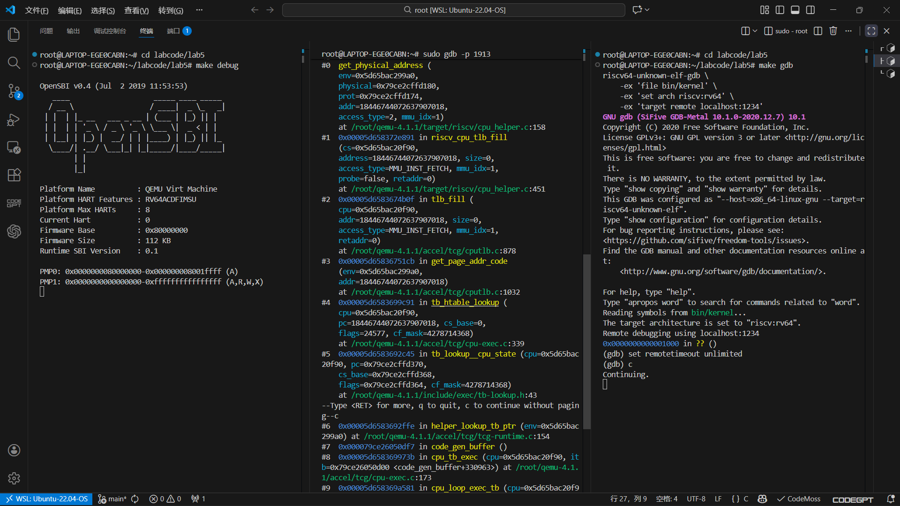
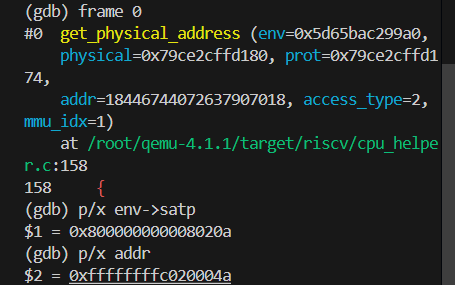
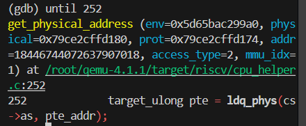
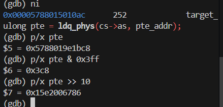
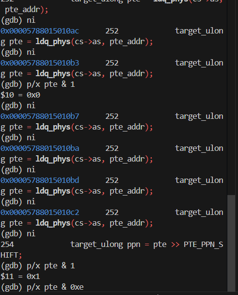
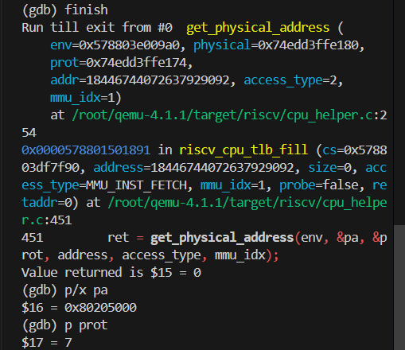
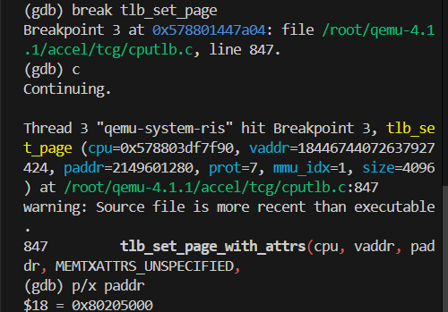
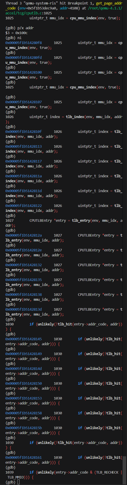
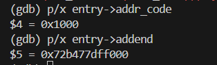
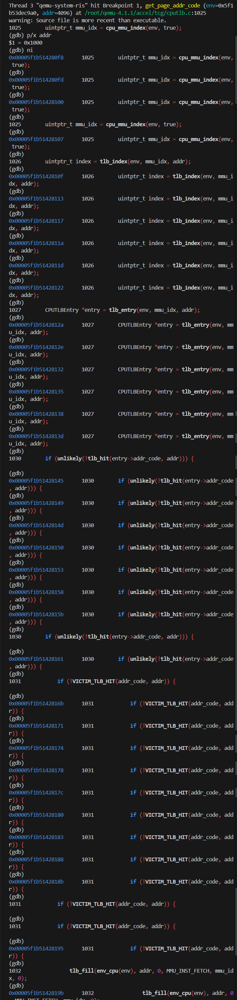

### 练习1: 加载应用程序并执行

#### 1. 设计实现过程 (`load_icode` 第6步)

在 proc.c 的 `load_icode` 函数中，我们需要设置新进程的 `trapframe`，以便内核在返回用户态时，CPU 能跳转到应用程序的入口点，并使用正确的用户栈。

**代码实现要点：**

```c
    // 设置用户栈指针 (sp) 为用户栈顶 USTACKTOP
    tf->gpr.sp = USTACKTOP;
    // 设置程序计数器 (epc) 为 ELF 文件的入口地址
    tf->epc = elf->e_entry;
    // 设置状态寄存器 (status)
    // 1. 清除 SSTATUS_SPP (Supervisor Previous Privilege)，确保 sret 返回时进入用户模式 (User Mode)
    // 2. 设置 SSTATUS_SPIE (Supervisor Previous Interrupt Enable)，确保进入用户模式后中断是开启的
    tf->status = (sstatus & ~SSTATUS_SPP) | SSTATUS_SPIE;
```

#### 2. 用户态进程从 RUNNING 到执行第一条指令的经过

当调度器 `schedule` 选择了一个用户态进程并将其状态设为 `RUNNING` 后，流程如下：

1.  **切换上下文 (`switch_to`)**: `schedule` 调用 `proc_run`，进而调用 `switch_to`，将 CPU 的寄存器（包括栈指针 `sp`）切换到新进程的内核栈。
2.  **内核线程入口 (`forkret`)**: 新进程恢复执行（如果是新创建的进程，会从 `forkret` 开始）。
3.  **中断返回处理 (`forkrets`)**: `forkret` 调用 `forkrets`（位于 trapentry.S），它接收当前进程的 `trapframe` 指针作为参数。
4.  **恢复寄存器 (`__trapret`)**: `forkrets` 跳转到 `__trapret`。在此处，汇编代码从 `trapframe` 中恢复所有通用寄存器（`RESTORE_ALL`）。
5.  **特权级切换 (`sret`)**: 执行 `sret` 指令。CPU 根据 `sstatus` 的 SPP 位（已被设为 0）切换到用户模式，并跳转到 `sepc` 寄存器指向的地址（即 `tf->epc`，应用程序入口）。
6.  **执行指令**: CPU 开始执行应用程序的第一条指令。

---

### 练习2: 父进程复制自己的内存空间给子进程

#### 1. 设计实现过程 (`copy_range`)

在 pmm.c 的 `copy_range` 函数中，我们需要将父进程的内存页内容复制给子进程，并建立映射。

**代码实现要点：**

```c
        if (*ptep & PTE_V) {
            // ... (获取父进程页面 page) ...
            // 1. 分配一个新的物理页
            struct Page *npage = alloc_page();
            assert(npage != NULL);
            
            // 2. 获取父子进程页面的内核虚拟地址
            void *kva_src = page2kva(page);
            void *kva_dst = page2kva(npage);
            
            // 3. 复制内存内容 (4KB)
            memcpy(kva_dst, kva_src, PGSIZE);
            
            // 4. 建立子进程页表映射
            // 使用与父进程相同的权限 perm
            ret = page_insert(to, npage, start, perm);
            assert(ret == 0);
        }
```

#### 2. Copy on Write (COW) 机制设计

**概要设计：**
COW 的核心思想是**推迟内存复制**，直到真正发生写操作时才进行。

*   **Fork 阶段 (`do_fork` -> `copy_range`)**:
    *   不分配新物理页，也不复制内存。
    *   将子进程的页表项指向**父进程相同的物理页**。
    *   将父进程和子进程的该页表项权限都设置为**只读 (Read-Only)**，取消写权限 (`PTE_W`)。
    *   增加该物理页的引用计数 (`page_ref_inc`)。

*   **写操作阶段 (Page Fault)**:
    *   当任一进程尝试写入该页时，CPU 触发页访问异常（Store Page Fault）。
    *   **异常处理 (`do_pgfault`)**:
        1.  检查异常原因是否为写权限错误。
        2.  检查该页是否标记为 COW 页（可以通过页表项的保留位标记，或者判断引用计数 > 1 且当前只读）。
        3.  **执行复制**: 分配一个新的物理页，将旧页内容拷贝过去。
        4.  **更新映射**: 将当前进程的页表项指向新页，并恢复**读写权限 (`PTE_W`)**。
        5.  **减少引用**: 减少原物理页的引用计数。如果引用计数降为 1，则原页也可以恢复写权限。

---

### 练习3: 阅读分析源代码，理解进程执行 fork/exec/wait/exit 的实现

#### 1. fork/exec/wait/exit 执行流程分析

*   **fork**:
    *   **用户态**: 调用 `fork()`。
    *   **内核态**: `sys_fork` -> `do_fork`。内核分配新的 `proc_struct` 和内核栈，复制父进程的内存空间（或 COW 设置）和 `trapframe`。子进程被设为 `PROC_RUNNABLE` 并加入就绪队列。
    *   **返回**: 父进程返回子进程 PID，子进程返回 0（通过修改子进程 `trapframe` 中的 `a0` 寄存器实现）。

*   **exec**:
    *   **用户态**: 调用 `exec()`。
    *   **内核态**: `sys_exec` -> `do_execve`。内核回收当前进程的内存空间 (`exit_mmap`)，调用 `load_icode` 加载新的 ELF 二进制文件，重新设置用户栈和 `trapframe`（如练习1所述）。
    *   **返回**: 不返回原程序，而是通过中断返回机制跳转到新程序的入口点。

*   **wait**:
    *   **用户态**: 调用 `wait()`。
    *   **内核态**: `sys_wait` -> `do_wait`。查找是否有状态为 `PROC_ZOMBIE` 的子进程。
        *   如果有，回收该子进程剩余的内核资源（`proc_struct` 和内核栈），返回 PID 和退出码。
        *   如果没有僵尸子进程但有存活子进程，当前进程状态设为 `PROC_SLEEPING` 并调用 `schedule()` 让出 CPU。
    *   **交互**: 等待子进程退出唤醒。

*   **exit**:
    *   **用户态**: 调用 `exit()`。
    *   **内核态**: `sys_exit` -> `do_exit`。回收大部分内存资源 (`mm_destroy`)，将状态设为 `PROC_ZOMBIE`，设置退出码。
    *   **交互**: 如果父进程在 `wait`，则唤醒父进程；如果父进程没在 `wait`，自己变成僵尸进程等待父进程回收。最后调用 `schedule()`。

**内核态与用户态交错**: 用户程序通过系统调用（`ecall`）陷入内核态，内核处理完后通过 `sret` 返回用户态。
**结果返回**: 通过修改 `trapframe` 中的 `a0` 寄存器将系统调用的返回值传递给用户程序。

#### 2. 用户态进程生命周期图

```text
  (alloc_proc)          (wakeup_proc)
      |                      |
      V                      V
  PROC_UNINIT  ------> PROC_RUNNABLE <----(时间片耗尽/被抢占)-----
                             |      \                            |
                             |       \ (proc_run)                |
                             |        \                          |
                             V         V                         |
                       (do_wait)    RUNNING  --------------------+
                       (do_sleep)      |
                       (try_free)      | (do_exit)
                             |         |
                             V         V
                        PROC_SLEEPING  PROC_ZOMBIE
                             |            |
                             |            | (父进程 do_wait 回收)
                             +------------+
                                          |
                                          V
                                     (NULL/Freed)
```

*   **RUNNING**: 正在 CPU 上执行。
*   **RUNNABLE**: 就绪状态，等待调度。
*   **SLEEPING**: 阻塞状态，等待事件（如子进程退出）。
*   **ZOMBIE**: 退出状态，等待父进程回收资源。

## 分支任务：GDB调试页表查询过程

## 演示某个访存指令访问的虚拟地址是如何在qemu的模拟中被翻译成一个物理地址的/页表翻译流程

### 0. 前置准备

打开三个终端，分别用于：1. 启动 QEMU、2. 调试 QEMU 源码、3. 调试内核。

### 1. 终端1：启动 QEMU（暂停状态）

```bash
cd ~/labcode/lab5   
make debug          # 该命令包含 -S -s 参数，使 CPU 暂停，调试桩端口为 1234
```

### 2. 终端2：附加到 QEMU 进程并设置断点

```bash
# 查找 qemu-system-riscv64 的进程 ID，记下来备用
pgrep -f qemu-system-riscv64
# 附加到该进程进行调试
sudo gdb -p <上述命令查到的PID>

# GDB 内部配置（避免无关信号干扰）
(gdb) handle SIGPIPE nostop noprint

# 设置断点：仅在 satp 非 0（分页开启）且为指令取指时触发
(gdb) break get_physical_address if env->satp!=0 && access_type==MMU_INST_FETCH
# 让 QEMU 继续运行，等待断点命中
(gdb) continue
```

此时终端2会挂起，等待断点触发。

### 3. 终端3：连接调试桩，运行内核至分页开启

```bash
cd ~/labcode/lab5
make gdb      # 等价于执行：file bin/kernel; set arch; target remote localhost:1234
set remotetimeout unlimited
# 让内核继续运行，直到修改 satp 开启 SV39 分页
(gdb) c
```

当内核触发指令取指的地址翻译时，终端2的断点会命中并停下。

### 4. 终端2：断点命中后，分析地址翻译过程

#### 1. 确认调用栈和当前环境

```gdb
(gdb) bt                # 查看调用栈
(gdb) frame 0           # 切换到 get_physical_address 函数栈帧
(gdb) p/x env->satp     # 验证 satp 非 0，mode=8 表示 SV39 模式
(gdb) p/x addr          # 打印当前待翻译的虚拟地址
```



在 `bt` 查看调用栈后，我们可以找到取指 `TLB miss` 触发翻译的关键调用链：

```
get_page_addr_code（TLB 查找）→ miss 进入 tlb_fill → riscv_cpu_tlb_fill → get_physical_address 翻译 → TLB 填充 → 返回到 TCG TB 查找/执行。
```

切换到 `get_physical_address` 函数栈帧后，可以看到此时satp寄存器非0且进入SV39模式，当前待翻译的虚拟地址为`0xffffffffc020004a`




#### 2. 跳转到首次读取 PTE 的代码行（RV64 对应 cpu_helper.c 第 252 行）

这里我直接从qemu源码中找到了首次读取PTE的代码行（252行），因此直接跳转到这一行。

```gdb
(gdb) until 252         # 或用 break cpu_helper.c:252; c 替代
```



PTE`（Page Table Entry）`是页表中的一条表项，用来把虚拟页号映射到物理页框，并附带权限/状态位。对 RISC‑V SV39 而言：高位是 PPN（物理页号），低 10 位是标志位`（V、R、W、X、U、G、A、D 等）`。R/W/X 全为 0 表示“中间表项”指向下一层页表；有 R/W/X 表示“叶子表项”，直接给出物理页号，权限检查通过后用它生成物理地址并填入 TLB。

#### 3. 查看页表索引、偏移、PTE 地址等关键值

```
(gdb) p i               # 当前层级的索引值
(gdb) p ptshift         # 当前层对应的 VPN 段偏移量，SV39 初始为 18，下一层每次减 9。
(gdb) p/x base          # 页表基地址
(gdb) p/x pte_addr      # 当前 PTE 的物理地址
```

#### 4. 单步执行读取 PTE，并解析 PTE 内容

在单步执行时，我了解到有两个指令：

- si（stepi/step instruction）逐条指令单步，遇到函数调用会“进入”被调函数。
- ni（nexti/next instruction）也是按指令单步，但遇到函数调用会“越过”整个调用，在当前帧停下

在我的调试方案中，主要用到了ni。

```
(gdb) ni                # 执行 ldq_phys 指令，读取 PTE
(gdb) p/x pte           # 打印完整 PTE 值
(gdb) p/x pte & 0x3ff   # 提取 PTE 低十位标志位（V/R/W/X/U 等）
(gdb) p/x pte >> 10     # 提取 PPN（物理页号）
```



#### 5. 继续单步，观察分支走向

```
(gdb) ni                # 逐行执行，查看代码走哪条分支
```

关键分支判断：

```
V 位：p/x pte & 1，0 则 Invalid。
R/W/X 组合：p/x pte & 0xe，为 0 说明内层继续走下一层；0x4/0xc 是保留非法。
U/S 权限：p/x pte & 0x10 。
对齐：p/x ((pte>>10) & ((1ULL<<ptshift)-1)) 非 0 则 misaligned。
访问类型：读需 R 或 (X+MXR)，写需 W，取指需 X。
```

在我执行了差不多七次ni后，执行完 `ldq_phys` 指令，随后检查各项关键数据以进行分支判断：

如图，

`(gdb) p/x pte & 1 = 0x1` 表示此PTE有效。

`(gdb) p/x pte & 0xe = 0xe`表示 R/W/X 三个位都为 1：这是一个叶子 PTE（不会走“内层继续遍历”分支），且不是保留的非法组合。

`pte & 0x10 = 0x0` 表示 U 位为 0，这个页表项是特权页，用户态不能访问。

`((pte>>10) & ((1ULL<<ptshift)-1)) = 0` 表示 PPN 对齐检查通过，没有 `superpage` 对齐错误。

自此，这个叶子 PTE 可以直接用来生成物理地址并填入 TLB。

此时可以直接通过 `finish`命令 从 `get_physical_address` 跳回调用者 `riscv_cpu_tlb_fill`,返回值 为 0。在 QEMU 里 `TRANSLATE_SUCCESS` 定义为 0，说明本次地址翻译成功。

此时 `riscv_cpu_tlb_fill` 里的局部变量 `pa / prot` 已填好，可以在当前帧直接看：

```
(gdb) p/x pa
(gdb) p prot
```



#### 6. 跟踪 TLB 填充过程

(gdb) break tlb_set_page  # 设置 TLB 填充断点
(gdb) c                   # 继续执行至 TLB 填充
(gdb) p/x paddr       # 打印最终翻译后的物理地址



可以看到翻译后的物理地址与之前查到的一样，我们成功追踪了虚拟地址的翻译与tlb填充的过程。

#### 7. 继续运行或重复分析

```
(gdb) c                   # 让程序继续运行，可重复触发断点分析其他地址
```

### 多级页表遍历流程

`ptshift = (levels-1)*ptidxbits`，从最高层开始，每层循环：

1. 计算本层索引 `idx = (addr >> (PGSHIFT + ptshift)) & ((1<<ptidxbits)-1)`。
2. 计算 PTE 物理地址 `pte_addr = base + idx * ptesize`。
3. 可选 PMP 权限检查（PMP 硬件模拟）。
4. 读取 PTE：RV64 用 `ldq_phys(cs->as, pte_addr)；ppn = pte >> PTE_PPN_SHIFT`。
5. 分支检查：
   - `!(pte & PTE_V)`：无效，返回 FAIL。
   - `!(pte & (R|W|X))`：内层 PTE，`base = ppn << PGSHIFT`; 继续下一层。
   - 保留组合：仅 W 或 W+X，返回 FAIL。
   - U/S 权限：U 位与当前 `mode/SUM/FETCH` 的约束；非 U 页但 mode 不是 S 也 fail。
   - PPN 对齐：ppn 低位与 ptshift 不对齐则 fail（superpage 对齐检查）。
   - 访问类型权限：LOAD 需 R 或 (X+MXR)；STORE 需 W；FETCH 需 X，否则 fail。
6. 叶子分支（通过上述检查）：
   - 更新 A/D 位：`updated_pte = pte | PTE_A | (store?PTE_D:0)`，如果 PTE 在 RAM 中且变了，用 CAS 原子更新；若被改了则重走（goto restart）；在 ROM/IO 无法更新则 fail。
   - 计算物理地址：`vpn = addr >> PGSHIFT; *physical = (ppn | (vpn & ((1<<ptshift)-1))) << PGSHIFT;`（superpage 时用虚拟页号低位补全）。
   - 设置 `*prot：R` 或 `(X+MXR)`给 READ；X 给 EXEC；W 且（存储访问或原 PTE 带 D）给 WRITE。
   - `return SUCCESS`;
7. 循环结束若没返回，整体 fail。


#### 常见卡点与处理

1. `env->satp` 打印为 0：说明仍处于 BARE 模式，在终端3执行 `(gdb) c`，让内核继续运行，直到终端2断点再次命中（satp!=0）。

2. 断点触发过于频繁：给断点增加地址条件，例如：

   ```gdb
   (gdb) break get_physical_address if env->satp!=0 && access_type==MMU_INST_FETCH && addr==0x80200000
   ```


## TLB查询

### 终端分工

- 终端1：启动暂停状态的 QEMU
- 终端2：通过宿主 GDB 调试 QEMU 进程，观察 TLB 查找/命中/缺失流程
- 终端3：通过 RISC-V GDB 连接调试桩，运行内核触发目标访存操作

### 操作步骤

### 终端1：启动 QEMU（暂停状态）

```bash
cd ~/labcode/labX
make debug          # 携带 -S -s 参数启动 QEMU，CPU 暂停，GDB stub 端口为 1234
```

### 终端2：宿主 GDB 附加 QEMU，观察 TLB 流程

```bash
# 1. 查找 qemu-system-riscv64 进程 PID 并记录
pgrep -f qemu-system-riscv64

# 2. 附加到 QEMU 进程调试
sudo gdb -p <上述命令输出的PID>

# 3. GDB 基础配置（屏蔽无关信号）
(gdb) handle SIGPIPE nostop noprint

# 4. 断点到 TLB 查找入口（可指定目标地址过滤）
(gdb) break get_page_addr_code
# 可选：仅关注指定虚拟页地址，添加条件
# (gdb) break get_page_addr_code if addr==0x80200000

# 5. 让 QEMU 继续运行，等待断点命中
(gdb) continue
```

#### 断点命中 get_page_addr_code：判断 TLB 命中/缺失

```gdb
# 查看当前待查询的虚拟地址
(gdb) p/x addr

# 单步执行，判断 TLB 状态
(gdb) ni  
# - 若跳转到 tlb_fill → TLB miss（未命中）
# - 若直接返回 → TLB hit（命中）
```



可以看到，这次由于`tlb_hit(entry->addr_code, addr)` 判定为命中，所以没有跳进 `tlb_fill`，直接往后执行

可以在当前帧检查命中的条目内容：

```
p/x entry->addr_code
p/x entry->addend
```



上面是一个tlb命中的实例，接着c，触发下一个断点，在多次尝试后，我又找到一个tlb缺失的例子：

触发中断后用ni单步执行，观察走向：


可以发现，tlb未命中的整个流程为：

```
get_page_addr_code → 发现 tlb_hit 失败 →（先试 VICTIM_TLB_HIT，仍未命中）→ tlb_fill → riscv_cpu_tlb_fill → get_physical_address 做页表遍历/权限检查 → 返回物理地址/权限 → tlb_set_page 填充 TLB → 返回，重新取 entry 命中。
```

如果想观察 `tlb miss` 后的流程，可以在终端2设置三个断点：

```
# TLB miss 入口
break tlb_fill if access_type==MMU_INST_FETCH

# 翻页核心，命中后单步页表
break get_physical_address if env->satp!=0 && access_type==MMU_INST_FETCH

break /root/qemu-4.1.1/target/riscv/cpu_helper.c:252
continue
```

在 `tlb_fill` 命中后：

看调用栈 bt，参数 `p/x addr、p access_type、p mmu_idx` 确认。
finish 或直接 continue，下一站会落到 `get_physical_address`，后面的流程与页表遍历一致。

### 终端3：RISC-V GDB 连接调试桩，触发访存

```bash
cd ~/labcode/labX
make gdb  # 等价操作：file bin/kernel; set arch; target remote localhost:1234
set remotetimeout unlimited
# 运行内核，触发目标地址的取指/访存操作
(gdb) c
```

## 两轮断点对比：BARE 模式 vs SV39 模式地址翻译流程

通过对比「未开启虚拟内存（BARE 模式）」和「开启虚拟内存（SV39 模式）」两个阶段的断点触发与执行路径，清晰区分 RISC-V 裸机/分页模式下的地址翻译逻辑差异。

### 前置准备

1. 终端1：启动暂停状态的 QEMU（始终保持运行）

   ```bash
   cd ~/labcode/labX
   make debug  # 带 -S -s，GDB stub=1234，CPU 暂停
   ```

2. 终端2：宿主 GDB 附加 QEMU 进程（核心调试端）

   ```bash
   pgrep -f qemu-system-riscv64  # 查 PID
   sudo gdb -p <PID>
   (gdb) handle SIGPIPE nostop noprint
   ```

3. 终端3：RISC-V GDB 连接调试桩（控制内核运行）

   ```bash
   cd ~/labcode/labX
   make gdb  # 连接 localhost:1234
   set remotetimeout unlimited
   ```

### 第一轮：观察未开启虚拟内存（satp=0，BARE 模式）

#### 步骤1：终端2 设置 BARE 模式断点

```gdb
# 断点：地址翻译入口，仅匹配 BARE 模式+指令取指
(gdb) break get_physical_address if env->satp==0 && access_type==MMU_INST_FETCH
# 让 QEMU 继续运行，等待断点命中
(gdb) continue
```

#### 步骤2：终端3 触发内核早期代码（未写 satp）

```gdb
(gdb) c  # 让内核运行（此时 satp=0，处于 BARE 模式）
```

#### 步骤3：终端2 断点命中后分析

```gdb
# 1. 查看调用栈，确认执行路径
(gdb) bt
# 2. 切换到 get_physical_address 栈帧
(gdb) frame 0
# 3. 核心观察点：
(gdb) p/x env->satp  # 输出为 0，确认 BARE 模式
(gdb) p/x *physical  
(gdb) p/x *prot      
```


此时 mmu_idx=3（M 模式取指）、satp=0，进入函数很快就满足 mode == PRV_M 分支，直接走了“phys=addr，prot=RWX，返回成功”路径，没有页表遍历。finish 后返回值 0 就是 TRANSLATE_SUCCESS，符合未开启分页时的直映翻译结果。

**关键结论**：`get_physical_address` 直接返回，不进入页表遍历循环（无读取 PTE、权限检查等操作），虚拟地址=物理地址。

### 第二轮：观察开启虚拟内存（satp≠0，SV39 模式）

#### 步骤1：终端2 清理旧断点，设置 SV39 模式断点

```gdb
# 删除所有断点
(gdb) delete

# 设置新断点：仅匹配 SV39 模式+指令取指

(gdb) break get_physical_address if env->satp!=0 && access_type==MMU_INST_FETCH
(gdb) continue
```

#### 步骤2：终端3 触发内核开启分页

```gdb
(gdb) c  # 让内核运行至写 satp 寄存器，开启 SV39 分页
```

#### 步骤3：终端2 断点命中后分析

```gdb
# 1. 确认分页模式与调用栈
(gdb) frame 0
(gdb) p/x env->satp  # 输出非 0，mode 字段=8（SV39 模式）
(gdb) bt             # 可见 tlb_fill → riscv_cpu_tlb_fill → get_physical_address 调用链

# 2. 跟踪页表遍历流程（跳转到首次读 PTE 行）
(gdb) break cpu_helper.c:252
(gdb) c
# 打印页表遍历核心变量
(gdb) p/x idx        # 当前层级索引
(gdb) p/x pte_addr   # PTE 物理地址
(gdb) ni             # 执行读 PTE 操作
(gdb) p/x pte        # 打印 PTE 完整值
(gdb) p/x pte & 0x3ff # PTE 标志位（V/R/W/X/U 等）
(gdb) p/x pte >> 10  # PPN（物理页号）
# 逐 ni 执行，观察三层页表遍历、权限检查、Superpage 对齐等分支

# 3. 跟踪 TLB 填充过程
(gdb) break tlb_set_page
(gdb) c
(gdb) p/x vaddr      # 虚拟地址
(gdb) p/x paddr      # 翻译后的物理地址
(gdb) p prot         # 最终页面权限（非 RWX 全开，由 PTE 决定）
```

**关键结论**：触发 TLB miss 后进入完整页表遍历流程，经过 PTE 读取、权限校验、A/D 位更新等步骤，最终填充 TLB，虚拟地址≠物理地址，权限由 PTE 约束。

### 核心对比总结

| 维度     | BARE 模式（satp=0）             | SV39 模式（satp≠0）                   |
| -------- | ------------------------------- | ------------------------------------- |
| 地址映射 | 虚拟地址 = 物理地址             | 虚拟地址 → 多级页表遍历 → 物理地址    |
| 执行路径 | get_physical_address 直接返回   | TLB miss → 页表遍历 → TLB 填充        |
| PTE 操作 | 无（不走取 PTE 分支）           | 读取 PTE、校验 V/R/W/X/U 位、更新 A/D |
| 权限控制 | 固定 RWX 全开                   | 由 PTE 标志位 + MXR/SUM 等寄存器约束  |
| TLB 交互 | 无 TLB 填充（直接返回物理地址） | 遍历完成后填充 TLB，后续命中无需遍历  |

## 一、调试中的有趣细节

### 1. 精确拦截特定页的地址翻译

通过条件断点可精准聚焦目标虚拟页的翻译过程，结合TLB填充断点能完整观测映射结果：

```gdb
# 仅拦截SV39模式下、指令取指、目标虚拟页的地址翻译
(gdb) break get_physical_address if env->satp!=0 && access_type==MMU_INST_FETCH && addr==0x80200000
# 配合TLB填充断点，查看最终物理地址与权限
(gdb) break tlb_set_page
```

### 2. TLB命中/缺失的执行链路差异

- **TLB命中**：在`get_page_addr_code`中直接返回映射结果，不走后续流程；
- **TLB缺失**：触发`tlb_fill → riscv_cpu_tlb_fill → get_physical_address`完整链路；
- **BARE模式（satp=0）**：链路仍执行，但早期分支直接返回`phys=virt`，不会读取PTE、遍历页表。

### 3. 页表遍历状态的直观观测

在读取PTE的代码行（`cpu_helper.c:252`）前，通过打印变量可清晰看到遍历层级状态：

```gdb
(gdb) p i          # 当前遍历层级（SV39为0/1/2）
(gdb) p ptshift    # 当前层级的地址偏移量
(gdb) p/x base     # 当前层级页表的基地址
(gdb) p/x pte_addr # 当前PTE的物理地址
# 执行ldq_phys后解析PTE
(gdb) ni
(gdb) p/x pte & 0x3ff  # 查看PTE标志位（V/R/W/X/U等）
(gdb) p/x pte >> 10    # 查看PTE中的物理页号（PPN）
```

### 4. 无效PTE（V=0）的翻译失败表现

若PTE的V位（有效位）为0，会立即返回`TRANSLATE_FAIL`；后续TLB缺失会快速再次触发翻译，断点处可连续观测到多次`get_physical_address`调用。

### 5. TLB条目特殊标志的慢路径处理

TLB条目的`addr_code`若带有`TLB_RECHECK`/`TLB_MMIO`标志，即使TLB命中也会返回`-1`，触发慢路径执行（逐指令模拟、IO回调处理），保证特殊场景的正确性。

## 二、通过QEMU软件模拟理解硬件机制

### 1. QEMU TLB的软件实现特点

QEMU的TLB完全由软件实现，无硬件的时序约束与随机性：

- 容量可动态调整，支持victim TLB（后备TLB）；
- 核心逻辑与硬件一致：“先查TLB，miss再遍历页表”；
- 替换策略由代码控制，而非硬件的硬件算法（如LRU硬件电路）。

### 2. A/D位的软件更新逻辑

硬件中MMU会自动置位PTE的A位（访问位）、D位（脏位），而QEMU的实现为：

- 在TLB miss处理中通过CAS（原子比较交换）软件更新A/D位；
- 若PTE位于ROM/IO区域（无法写入），直接返回翻译失败，硬件中通常触发异常或由外设处理。

### 3. BARE模式与SV39模式的翻译链路差异

- **BARE模式**：翻译链路仅执行“虚拟地址=物理地址”的简化逻辑，无页表遍历、权限检查；
- **SV39模式**：触发完整流程——三层页表遍历 → PTE权限校验（U/S、访问类型） → Superpage对齐检查 → TLB填充。

### 4. 软件语义扩展的慢路径

硬件TLB仅负责地址映射，而QEMU为保证模拟正确性，通过`TLB_RECHECK`/`TLB_MMIO`标志扩展语义：

- 命中带特殊标志的TLB条目时，退化为慢路径（逐指令执行、回调IO处理）；
- 该设计体现模拟器“正确性优先于时序”的特点，是软件模拟对硬件的功能补充。

## 通过大模型解决的问题

1. 在实验最开始，当我进入 `get_physical_address` 帧时，为了进行进一步的研究，我需要定位到首个取PTE的行，最开始我是逐个ni，但是我发现这个过程有点太漫长了，询问大模型后，它建议我直接进入到qemu源码中去找到这一行并采取打断点或until <行号>的方式直接定位到那一行。

2. 由于我对不同函数栈帧里的符号不太了解，在实验时出现了作用域/变量找不到的问题，例如：我在 tlb_set_page 想打印 physical 地址却出现了报错，向大模型询问后，我得到解释是当前栈帧没有该符号，要切回 get_physical_address 帧或直接看 paddr 参数。

### lab5 GDB调试全流程

1. **终端1**: 启动 QEMU 等待调试

   ```bash
   make debug
   ```

2. **终端2**: 调试 QEMU 进程 (Host GDB)

   * 获得 QEMU 的线程号 (PID)。

   * 启动 GDB 并 attach 到该 PID:

     ```bash
     sudo gdb
     attach <线程号>
     ```

   * 设置 GDB 忽略 SIGPIPE 信号:

     ```gdb
     handle SIGPIPE nostop noprint
     ```

   * 继续执行:

     ```gdb
     c
     ```

3. **终端3**: 连接 QEMU GDB Stub 调试内核/用户程序 (Guest GDB)

   * 启动 GDB:

     ```bash
     make gdb
     ```

   * 在 GDB 中执行:

     ```gdb
     set remotetimeout unlimited
     add-symbol-file obj/__user_exit.out
     # 确认加载符号 (输入 y)
     break user/libs/syscall.c:18
     c
     ```

   * 程序会停在断点处，查看指令:

     ```gdb
     x/12i $pc
     ```

   * 单步调试 (`si`) 直到 `ecall` 指令，**不要执行 ecall**。

4. **终端2**: 设置 QEMU 内部断点

   * 在 Host GDB 中中断执行 (Ctrl+C)，然后设置断点:

     ```gdb
     break riscv_cpu_do_interrupt
     c
     ```

5. **终端3**: 执行系统调用

   * 执行单步指令，触发 `ecall`:

     ```gdb
     si
     ```

**预期结果**: 终端2 (Host GDB) 应该捕获到断点，显示 `riscv_cpu_do_interrupt` 函数的信息。

**实际遇到的问题**:
终端2 输出如下错误，并没有停在预期的断点，且终端3 卡住。

```text
(gdb) c
Continuing.
Cannot find user-level thread for LWP 822: generic error
(gdb)
```


### 4. 调试过程中的一些问题

**1. 观察 ecall 和 sret 指令的 QEMU 处理流程**

**调试结果**：未调试出结果。
**原因**：如上文所述，在尝试使用 Host GDB 附加到 QEMU 进程并捕获 `riscv_cpu_do_interrupt` 时，遇到了 `Cannot find user-level thread for LWP` 的错误。尽管尝试了多种方法（如附加到不同子线程），GDB 始终无法正确控制 QEMU 的执行流，导致无法在 QEMU 源码层面观察到 `ecall` 的具体触发过程。

**2. TCG (Tiny Code Generator) 指令翻译原理**

虽然无法动态调试，但根据 QEMU 的原理，`ecall` 和 `sret` 的执行并非直接在宿主机 CPU 上运行，而是通过 **TCG** 进行翻译和模拟：

*   **基本流程**：QEMU 将客户机（Guest, RISC-V）的二进制指令翻译成中间码（TCG Ops），然后再编译成宿主机（Host, x86_64）的机器码执行。
*   **ecall 的处理**：
    *   在翻译阶段，当 TCG 遇到 `ecall` 指令时，会生成调用辅助函数（Helper Function）的代码，通常是 `helper_raise_exception`。
    *   在执行阶段，该 Helper 函数会将 CPU 的状态（如 `scause` 寄存器设置为 User/Supervisor Ecall，`sepc` 设置为当前指令地址）更新，并抛出一个异常（Exception）。
    *   QEMU 的主循环（Main Loop）捕获该异常，调用 `riscv_cpu_do_interrupt`，模拟硬件的中断处理流程（切换特权级、跳转到 `stvec` 等）。
*   **sret 的处理**：
    *   TCG 将 `sret` 翻译为调用 `helper_sret`。
    *   该 Helper 函数会读取 `sstatus` 中的 `SPP` 位来决定返回的特权级，读取 `SPIE` 恢复中断使能状态，并将 PC 设置为 `sepc` 的值。
    *   最后，它会刷新 TLB（如果需要）并通知 TCG 这一块代码块（Translation Block）执行结束，跳转到新的 PC 地址继续翻译/执行。

### 5. 调试趣事与大模型交互记录

**1. 半步与指令压缩**
在调试过程中，我观察到 `ecall` 指令的地址偏移量似乎有些奇怪：

```text
0x800100 <syscall+44>: ld  a5,72(sp)
0x800102 <syscall+46>: ecall
```

我向大模型提问：“为什么我的 ecall 前面是半步（只差了 2 个字节）？”
大模型指出，这不是“半步”，而是 **RISC-V 的 C 扩展（Compressed Instructions）**。标准的 RISC-V 指令是 4 字节，但为了节省空间，编译器自动将部分指令压缩为 2 字节。

**2. 文盲**

```
--Type <RET> for more, q to quit, c to continue without paging-- 
```

大模型：按c就行

**3. 几个警告**
·  warning: opening /proc/PID/mem file for lwp 77.77 failed 
大模型：这是因为WSL的安全机制或进程权限问题导致的 
·  warning: opening /proc/self/mem file failed 
同样是由于权限或文件系统限制，不影响调试 
·  warning: could not find '.gnu_debugaltlink' file 
缺少调试符号文件，因为系统库是发行版编译的，不包含完整调试信息 
这不影响调试QEMU源码 
·  停在 __GI_ppoll函数 
这是正常的，GDB附加到了QEMU的主事件循环 
QEMU正在等待事件（包括来自终端3的GDB连接）


**4. 线程跑飞**
在尝试解决 GDB 无法附加 QEMU 线程的问题时，我与大模型进行了多轮交互：

*   **问题**：GDB 报错 `Cannot find user-level thread`。
*   **大模型建议**：尝试使用 `info threads` 查看所有线程，发现线程往下跑了两个，好像是子线程。我尝试附加到 QEMU 的子线程上。
*   **尝试结果**：我按照建议操作，但 GDB 依然报错，甚至导致调试会话卡死。


# 扩展练习 Challenge：Copy-on-Write（COW）机制设计报告

## 1. 设计目标与概述

在标准的 `fork()` 操作中，传统实现会**立即复制父进程的全部物理内存**给子进程。这种方式不仅开销巨大，而且在实际使用中往往是**无意义的**，因为子进程通常会在 `fork` 之后立刻调用 `exec()`，导致刚复制的内存被完全丢弃。

**Copy-on-Write（COW）** 是一种延迟内存复制的优化机制，其核心思想是：

* 在 `fork` 时**不复制物理页**，而是让父子进程共享同一物理内存页；
* 将这些共享页在页表中标记为 **只读（Read-Only）**，并附加 **COW 标志**；
* 只有当某个进程尝试**写入**该页面时，才触发缺页异常，由内核完成真正的物理页复制。

通过这种方式，COW 能显著减少内存占用与拷贝开销，是现代操作系统中 `fork` 的标准优化策略。

---

## 2. 关键数据结构与宏定义

### 2.1 COW 标志位（PTE_COW）

在 uCore 的 RISC-V 架构下，页表项（PTE）中预留了若干位供软件使用。实验中利用该特性定义 COW 标志位：

```c
#define PTE_COW 0x100
```

* 该标志使用的是 **PTE 的第 8 位（RSW, Reserved for Software）**；
* 硬件在地址翻译过程中会忽略该位；
* 操作系统可利用它来区分普通只读页与 **COW 共享页**。

---

### 2.2 物理页引用计数（`page->ref`）

物理页结构体 `Page` 中维护的 **引用计数（ref）** 是 COW 机制的核心支撑：

* 表示当前物理页被多少个页表项映射；
* 在 `fork` 共享阶段引用计数递增；
* 在发生 COW 复制或进程退出时递减；
* 在缺页异常处理中，通过 `ref` 判断是否需要真正复制物理页。

---

## 3. 有限状态自动机（FSM）分析：物理页状态转换

在 COW 机制下，一个物理页在生命周期中会经历若干状态变化。这些状态可以用一个 **有限状态自动机（FSM）** 来描述，其状态由 **引用计数（ref）** 与 **页表项权限（PTE flags）** 共同决定。

---

### 3.1 状态定义

#### 3.1.1 独占写状态（Priv-W）

* **特征**：`ref == 1`，PTE 包含 `PTE_W`，不包含 `PTE_COW`
* **含义**：

  * 该物理页仅被一个进程拥有；
  * 进程拥有写权限；
  * 属于普通的、非共享的页面状态。

---

#### 3.1.2 共享只读状态（Shared-COW）

* **特征**：`ref > 1`，PTE 不包含 `PTE_W`，包含 `PTE_COW`
* **含义**：

  * 多个进程（父子进程）共享该物理页；
  * 所有进程仅拥有只读权限；
  * 任一进程写入都会触发缺页异常。

---

#### 3.1.3 最后共享状态（Last-COW，优化状态）

* **特征**：`ref == 1`，PTE 不包含 `PTE_W`，包含 `PTE_COW`
* **含义**：

  * 页面曾经被多个进程共享；
  * 由于其他进程退出或发生复制，当前进程成为唯一持有者；
  * 是一个**可优化的过渡状态**。

---

### 3.2 状态转换过程说明

#### A. Fork 触发共享（Priv-W → Shared-COW）

* **事件**：父进程调用 `fork()`

* **位置**：`copy_range()`

* **处理逻辑**：

  * 父进程页表项去除 `PTE_W`；
  * 添加 `PTE_COW` 标志；
  * 子进程映射同一物理页；
  * 物理页引用计数 `ref` 增加。

* **结果**：

  * 父子进程页表项均为只读 + COW；
  * 页面进入 `Shared-COW` 状态。

---

#### B. 读操作（状态保持）

* **事件**：进程读取共享页面

* **处理**：

  * 只读权限允许访问；
  * 不触发异常。

* **结果**：

  * 页面状态不发生变化。

---

#### C. 写操作（触发缺页异常）

写操作是 COW 的关键路径，对应 `do_pgfault()` 中的核心逻辑。

##### 情况 1：真正的写时复制（Shared-COW → Split）

* **前提**：`ref > 1`

* **事件**：进程写入页面，触发 `CAUSE_STORE_PAGE_FAULT`

* **处理流程**：

  1. 分配新的物理页 `npage`；
  2. 将原页面内容复制到新页；
  3. 当前进程页表项改指向新页；
  4. 新页设置为可写（Priv-W）；
  5. 原物理页引用计数减 1。

* **结果**：

  * 写入进程获得独占写页面；
  * 原页面继续被其他进程共享；
  * 若 `ref` 降为 1，则进入 `Last-COW` 状态。

---

##### 情况 2：独占优化（Last-COW → Priv-W）

* **前提**：`ref == 1`

* **典型场景**：

  * 子进程 `fork` 后立刻 `exit`；
  * 或其他进程已完成 COW 复制。

* **处理流程**：

  1. 不再分配新物理页；
  2. 直接修改页表项；
  3. 去除 `PTE_COW`，恢复 `PTE_W`。

* **结果**：

  * 页面回到普通的 `Priv-W` 状态；
  * 避免了不必要的内存复制开销。

---

## 4. 详细实现流程

### 4.1 Fork 阶段：建立共享（`pmm.c`）

在 `copy_range()` 中：

* 遍历父进程页表；
* 对可写页或已标记 COW 的页：

  * 清除 `PTE_W`；
  * 设置 `PTE_COW`；
* 调用 `page_insert()` 映射到子进程；
* `page_insert()` 内部自动增加引用计数；
* 刷新父进程 TLB，确保权限修改生效。

---

### 4.2 异常触发阶段（`trap.c`）

当用户程序执行写操作（如 `global_cnt = 100`）时：

* PTE 无写权限；
* CPU 触发 **Store Page Fault**；
* `exception_handler` 捕获异常；
* 设置错误码中的写标志位；
* 调用 `do_pgfault()`。

---

### 4.3 缺页处理阶段（`vmm.c`）

`do_pgfault()` 的处理逻辑如下：

1. 校验访问地址是否位于合法 VMA；
2. 检查页表项存在且包含 `PTE_COW`；
3. 根据物理页引用计数执行不同策略：

   * `ref == 1`：仅修改 PTE，恢复写权限；
   * `ref > 1`：分配新页并复制内容；
4. 调用 `tlb_invalidate()` 刷新 TLB。

---

## 5. 测试验证分析（`cowtest.c`）

`cowtest.c` 对 COW 机制进行了完整验证：

1. 初始化：`global_cnt = 0`；
2. 执行 `fork()`：

   * 父子进程共享同一物理页（Shared-COW）；
3. 子进程读取：

   * 读取成功，不触发异常；
4. 子进程写入：

   * 触发缺页异常；
   * 执行 COW 复制；
   * 子进程获得新页并写入 `100`；
5. 父进程检查：

   * 仍读取到 `0`。

若父进程读取到 `100`，说明内存未隔离，COW 失败。实验输出 **PASSED**，表明实现正确。

---

## 6. 总结

本实验通过在 `copy_range()` 与 `do_pgfault()` 中引入 COW 逻辑，结合页表权限控制与物理页引用计数，实现了高效、安全的 `fork` 内存共享机制。特别是针对 `ref == 1` 的优化路径，避免了不必要的内存分配与拷贝，充分体现了 Copy-on-Write 的设计优势。
